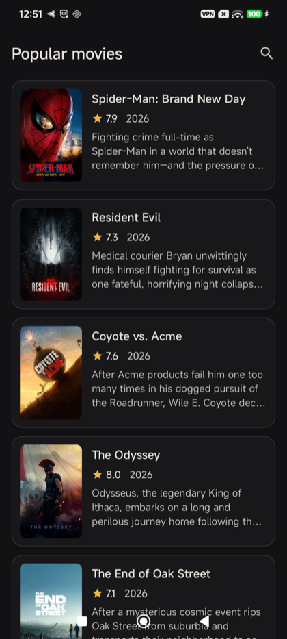
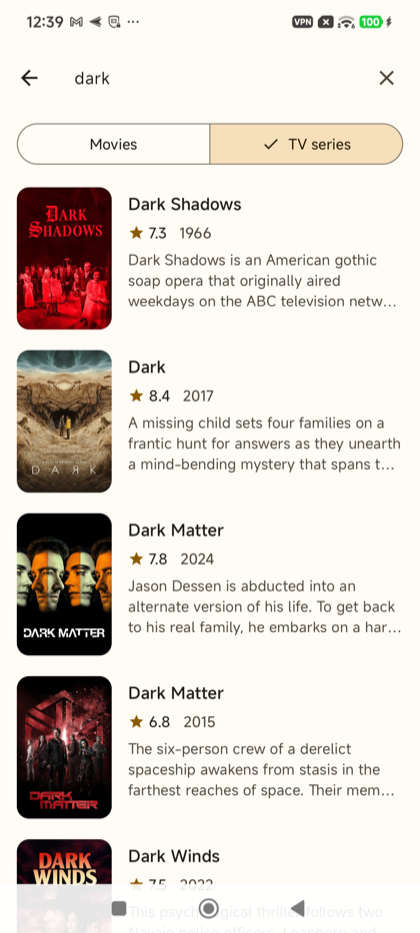
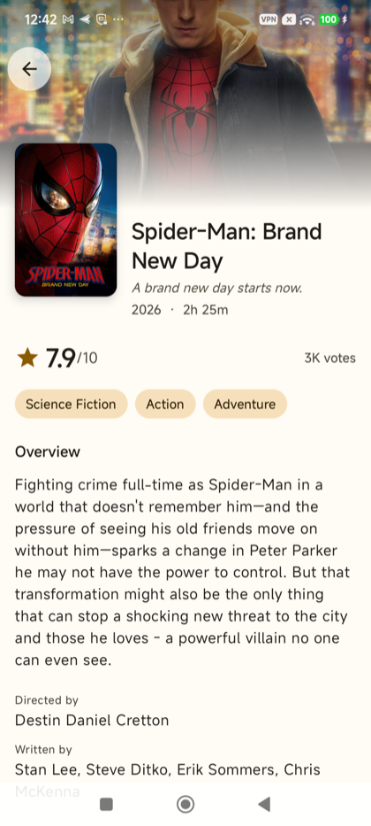
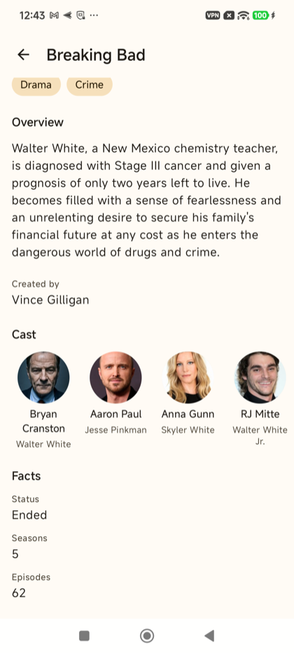

# MovieApp — 2Coders Studio tech assignment

An Android app that browses movies and TV shows from [The Movie Database (TMDB)](https://developer.themoviedb.org/docs/getting-started). It has three screens:

| Screen | What it does |
|---|---|
| **Movies** | Endless list of popular movies, each showing a title, poster and short description |
| **Details** | Extended information: rating, vote count, genres, runtime/seasons, directors/creators, writers and cast |
| **Search** | Debounced search over **movies or TV series**, chosen before searching, with paginated results |

Everything you've already seen keeps working **offline**: the movie list, details, posters and past searches. See [Offline support](#offline-support).

Built with Kotlin, Jetpack Compose, Navigation Compose, Koin, Retrofit, kotlinx.serialization, Coil and coroutines/Flow.

| Movies (dark) | Search (light) | Details | Details, scrolled |
|---|---|---|---|
|  |  |  |  |

---

## Setup

**Requirements:** Android Studio with AGP 9.4 support, and a device or emulator on API 24+. Gradle provisions JDK 25 for the daemon automatically through foojay.

1. **Get TMDB credentials.** Sign in at themoviedb.org → *Settings → API*, and copy both the **API Key** and the **API Read Access Token**.
2. **Create `tmdb.properties`** in the project root. Start from the template:
   ```bash
   cp tmdb.properties.example tmdb.properties
   ```
   ```properties
   api.key=<your API key>
   api.read.access.token=<your read access token>
   ```
   The file is gitignored. If it's missing or incomplete, the build fails with a message that names the missing key. You get a clear error at build time instead of an app that silently returns 401 on every request.
3. **Build and run.**
   ```bash
   ./gradlew installDebug
   ```

### Useful commands

```bash
./gradlew testDebugUnitTest      # all JVM unit tests
./gradlew :app:testDebugUnitTest --tests "*.SearchViewModelTest"   # one class
./gradlew lintDebug              # Android lint
./gradlew connectedDebugAndroidTest   # Room tests on a device or emulator
./gradlew assembleDebug          # build the APK
```

---

## Architecture

Clean Architecture in one `:app` module. The layers are packages, and dependencies only point inwards:

```
 presentation ──► domain ◄── data
 (Compose, VMs)   (pure Kotlin)   (Retrofit, DTOs)
        ▲                            ▲
        └──────────── di (Koin) ─────┘
```

```
com.twocoders.movieapp
├── core                logging, connectivity (ConnectivityObserver), time (Clock)
├── domain              no Android, Retrofit or serialization imports
│   ├── model           MediaSummary, MediaDetails (sealed), Credits, Page<T>, …
│   ├── error           AppError (sealed), DataResult<T>
│   ├── repository      repository interfaces
│   └── usecase         GetPopularMovies, GetMediaDetails, SearchMedia
├── data
│   ├── remote          TmdbApi, AuthInterceptor, ApiCallHandler, TmdbJson, dto/
│   ├── local           Room cache: MovieDatabase, entities, DAOs, MediaLocalDataSource
│   ├── mapper          DTO → domain, image URLs
│   └── repository      repository implementations + NetworkFirst
├── presentation
│   ├── paging          PaginationState (state machine) + Paginator
│   ├── common          shared components, error messages, formatters
│   ├── movies | details | search   one package per screen: ViewModel, UI state, Screen
│   ├── connectivity    offline banner + ConnectivityViewModel
│   ├── app             MovieAppRoot: nav graph + app-wide overlays
│   ├── navigation      type-safe routes + AppNavHost
│   └── ui/theme
├── di                  Koin modules (core, network, local, data, domain, presentation)
├── application/MovieApp.kt   Application, starts Koin
└── MainActivity.kt     single Activity
```

### How a request flows

`MovieListScreen` → `MovieListViewModel` → `Paginator` → `GetPopularMoviesUseCase` → `MovieRepository` (interface) → `MovieRepositoryImpl` → `NetworkFirst`, which uses `ApiCallHandler` + `TmdbApi` and falls back to the Room cache when offline → `DataResult<Page<MediaSummary>>` → `PaginationState` → a `StateFlow` the screen collects.

---

## Design decisions

### MVVM with state machines
Every screen exposes **one `StateFlow`** of immutable state, and the UI is a function of that state.

- **Lists** use `PaginationState<T>`, which has two parts: the screen content (`items`) and the state of the load operation (`status`, a sealed `PaginationStatus`).
  - `status` moves through `Idle → LoadingFirstPage/LoadingNextPage → Idle | EndReached | Error`.
  - Because content and operation state are separate, the UI can keep showing loaded items while a footer shows *loading more* or *retry*.
  - The transitions are pure functions, so they're unit-tested directly. A diagram is in the KDoc of `PaginationState`.
- **Details** uses a sealed `DetailsUiState`: `Loading`, `Content` or `Error`.
- **Search** uses `SearchUiState`, made of the query text, the media type, and a sealed `SearchResults` (`Idle` or `Content`).

### Pagination without Paging 3
The assignment asks for state machines, and owning the paginator keeps that logic visible and testable. Paging 3 would hide load state inside `LazyPagingItems`. `Paginator` is about 70 lines and handles the cases that matter:

- duplicate scroll triggers are ignored
- after an error, loading stops until the user retries; it doesn't retry by itself
- a refresh cancels the load in flight and drops its result
- items are de-duplicated across pages, because TMDB rankings shift between requests and a repeated id would crash a keyed `LazyColumn`

### Throttled search
`SearchViewModel` debounces the query by 400 ms, then trims it, combines it with the media type, and applies `distinctUntilChanged` and `flatMapLatest`.

- Only typing is debounced. Switching between movies and TV series searches immediately, and clearing the field resets right away.
- `flatMapLatest` cancels the request for an outdated query, so a slow old response can never replace newer results.
- Each search gets its own `Paginator`, so search results scroll endlessly too.

### Data model
- `MediaSummary` is the one list-item model for both movies and TV shows. The mappers hide TMDB's different field names (`title`/`name`, `release_date`/`first_air_date`).
- `MediaDetails` is a **sealed interface** with two variants, `MovieDetails` (runtime, budget, revenue) and `TvShowDetails` (seasons, episodes). The UI renders the shared fields once and uses an exhaustive `when` for the extras.
- `Credits` arrives already split into cast, directors and writers. For TV shows, the creators take the place of directors.
- The data layer normalises unknown values to `null`: TMDB sends `0` for an unknown budget or revenue, and blank strings for a missing tagline or date.

### Error handling
`ApiCallHandler` is the single place where Retrofit outcomes become a `DataResult<T>`:

1. It checks the HTTP status first. The body is decoded only for 2xx responses.
2. For a non-2xx response, it reads TMDB's error body (`status_code`, `status_message`) and maps it to a sealed `AppError`. The server's message is kept, so the UI can show something useful:
   - 401 → `Unauthorized`
   - 404 → `NotFound`
   - other codes → `Http(code, message)`
3. A failed connection becomes `NoConnection`, an undecodable body becomes `Parsing`, and anything else becomes `Unknown`.
4. Full details go to the log through `Logger`. Only the typed error reaches the UI.
5. `CancellationException` is always rethrown, so cancelling a coroutine (for example through `flatMapLatest`) keeps working.

Repositories and ViewModels never catch exceptions. They `when` over `DataResult` and `AppError`.

TMDB sometimes sends `null` where a list is expected. `TmdbJson` sets `coerceInputValues = true` and `explicitNulls = false`, and every DTO list defaults to `emptyList()`, so those `null`s decode to empty lists.

### Dependency injection (Koin)
- There's one module per layer, collected in `appModules`.
- Repositories are bound to their domain interfaces, so presentation and domain never see an implementation.
- `DetailsViewModel` gets its route arguments through `parametersOf` instead of `SavedStateHandle`. It stays a plain class that tests can construct directly.
- `AppModulesTest` starts the real graph and resolves every entry point, so a broken binding fails in CI instead of at launch.

### Navigation
- Navigation Compose uses type-safe `@Serializable` routes, and `DetailsRoute(id, type)` carries typed arguments.
- Screens receive callbacks instead of the `NavController`, which keeps them independent and previewable.
- There's a single Activity.

### Security
- Credentials live only in the gitignored `tmdb.properties` and reach the app through `BuildConfig`.
- The read access token is sent as a `Bearer` header, so it's never in URLs.
- The OkHttp logger runs in debug builds only, and always redacts `Authorization`.

---

## UI

Jetpack Compose only, with Material 3. There was no design to follow, so the goal was simple and calm: let the posters carry the colour, and keep the UI out of the way.

- **Splash screen.** It uses the AndroidX SplashScreen API (`installSplashScreen()` in `MainActivity` and `Theme.MovieApp.Starting`), so there's no separate splash Activity or composable. The splash is native on Android 12+ and backported below. Its background matches the app background in both themes, so the hand-off is seamless.
- **Edge-to-edge and portrait.** Edge-to-edge is on everywhere. It's enforced from targetSdk 35, and `enableEdgeToEdge()` gives older versions the same look. The app is locked to portrait, but Android 16+ ignores the lock on large screens, so layouts still work in landscape.
- **Brand theme.** A warm amber accent on neutral surfaces, with full light and dark colour schemes. Dynamic colour is turned off on purpose, so every reviewer sees the same app. The window background matches the Compose background, so there's no colour flash at launch.
- **Movies.** Each title is a floating card with a poster, title, ★ rating, year and a 3-line overview. In light theme the cards are white on the warm page, with a wide, soft shadow. In dark theme they use a raised tone and a faint border, because shadows don't show on dark surfaces. Pressing a card makes it settle toward the page.
- **Search.**
  - The search field sits in the top bar and gets focus on first entry, with a clear button.
  - A segmented **Movies / TV series** selector chooses what to search.
  - The layout accounts for the keyboard, and the keyboard hides once you scroll the results.
- **Details.**
  - A 16:9 backdrop behind the status bar fades into the page, with the poster overlapping its edge.
  - Below it: the rating with vote count, genre pills, overview, directors or creators, writers, a cast row, and per-type facts (budget and revenue, or seasons and episodes).
  - The top bar turns solid and shows the title once the backdrop scrolls away. The status bar icons switch colour to stay legible.
- **Every state is designed.** First-page loading and errors take the full screen and offer a retry. A failed next page shows an inline retry footer under the items that already loaded. There are empty states for "no results" and for search before anything is typed. Every error message is short and actionable. For example: *"You're offline. Check your connection and try again."*

### How the UI is built
- **Stateful screen, stateless content.** For example, `MovieListScreen(viewModel, …)` collects the state and passes it to `MovieListContent(state, callbacks)`. The content takes plain values only, so `@PreviewLightDark` can render it with `PreviewData`.
- **`PaginatedMediaList`** is shared by the movie feed and the search results. It maps a `PaginationState` to the full-screen states, keyed rows and the footer.
- **Infinite scroll.** A `snapshotFlow` over the list layout calls `loadMore()` when the user is 5 rows from the end. It emits the item count rather than a boolean, so a short page triggers the next load again. `Paginator` ignores duplicate calls, so the list can call `loadMore()` freely.
- **Edge-to-edge.** Lists draw behind the navigation bar, and their bottom inset goes into `contentPadding`. On the search screen, the Scaffold's insets include the IME.
- **Images.** Coil 3 loads every image through `PosterImage`, which shows a tinted placeholder with a type icon. That one placeholder covers loading, missing artwork and failures. Coil uses its own HTTP client, so the TMDB token is never sent to the image CDN.
- **Accessibility.**
  - The rating reads as "Rated 8.2 out of 10".
  - Headings are marked as headings, decorative images are skipped, and icon buttons have labels.
  - Text uses `maxLines` and ellipsis instead of fixed heights, so it handles large font sizes.
- **Display formatting.** Rating, compact vote counts (`30.2K`), runtime (`2h 19m`) and money (`$225M`) are pure functions in `Formatters.kt`, and they're unit-tested.
- **Text.** All text is in `strings.xml`, including plurals.

---

## Offline support

The goal is that users can't tell they're offline for anything they've already seen. Only content that was never loaded needs the internet, and the app says so clearly.

```
                 ┌───────────────┐ success ┌──────────────────┐
 repository ───► │  TMDB (fetch) │ ──────► │ save to Room     │ ──► fresh data
                 └───────┬───────┘         └──────────────────┘
                         │ NoConnection
                         ▼
                 ┌───────────────┐  found  ──► cached data (same domain objects)
                 │ Room (lookup) │
                 └───────────────┘  missing ──► "You're offline and this isn't saved yet"
```

- **Strategy: network first, cache fallback.** All three repositories go through one helper, `NetworkFirst`.
  - When online, every response is saved to Room and returned, so the cache always has the latest data the user saw.
  - When the fetch fails with `NoConnection`, the cached copy is returned.
  - Any other error (401, 404, 5xx, parsing) is passed through, so stale data never hides a real failure.
  - Cache reads and writes are best-effort. A cache problem is logged and never breaks a request that would otherwise work.
- **Why Room** and not DataStore or SharedPreferences: the cache holds paginated lists, full details and per-query search results, read back by key and page. That's relational data: Room gives indexed queries, atomic page replacement in a transaction, and an exported schema. DataStore suits small key-value settings.
- **Schema** (`data/local`, exported to `app/schemas/`):
  - `media`: one row per title, shared by the popular list and every search.
  - `pages` + `page_items`: ordered pages per list key (`popular:movie`, `search:movie:dune`).
  - `details`: one row per movie or show, with genres and credits as JSON columns.
  - Search keys ignore case, because TMDB search does. Search pages older than 7 days are pruned, along with titles no page refers to anymore.
  - The database is only a cache, so a future schema change rebuilds it rather than migrating.
- **What works offline:**
  - the popular pages already scrolled through
  - any movie or TV show already opened
  - any search already run, for the same media type
  - images, from Coil's 100 MB disk cache
- **What needs the internet:**
  - **Not cached:** a full-screen *"You're offline and this isn't saved on your device yet"*.
  - **Next page not cached:** the list footer says *"You're offline. Connect to load more."*
- **Feedback:**
  - When the connection drops, a small banner (*"You're offline · showing saved content"*) slides up for 5.5 s, then gets out of the way. Coming back online hides it at once.
  - Connectivity comes from `ConnectivityObserver`, which only counts validated internet, so a captive-portal Wi-Fi reads as offline.
- **Auto-recovery:** every screen with a failed load retries by itself when the device reconnects. Nobody has to tap *Try again*.

---

## Testing

There are 83 JVM unit tests under `app/src/test`, plus instrumented Room tests under `app/src/androidTest`. Their packages mirror the main source set:

| Layer | What's covered | How |
|---|---|---|
| domain | use cases: dispatch by type, blank-query short-circuit, trimming | hand-written fake repositories (`fakes/`) |
| data | every `AppError` mapping, the auth header, `null` handling, mapping (credits, image URLs, 500-page clamp), endpoint paths; `NetworkFirst` rules and an offline case per repository; cache mappers and converters | **MockWebServer** with the real Retrofit + `TmdbJson` stack (`TmdbServerRule`; going offline stops the server); `FakeMediaLocalDataSource` |
| data (device) | Room schema and queries: page order, replacement, titles shared across lists, search pruning, details round-trips | in-memory Room, `./gradlew connectedDebugAndroidTest` |
| presentation | pagination state transitions, `Paginator` concurrency, each ViewModel (for search: debounce, cancelling stale requests, type switch), auto-retry on reconnect, offline banner timing, display formatters | fakes + `MainDispatcherRule` + virtual time (`advanceTimeBy`), Turbine for emission order |
| di | the full Koin graph resolves | `KoinTestRule` |

Fakes are preferred over mocks. They record their calls and answer from a lambda the test can swap, which keeps assertions readable.

---

## Further documentation

- [`docs/runbooks/tmdb.md`](docs/runbooks/tmdb.md): TMDB integration runbook (credentials, gotchas, common errors, offline cache).
- KDoc on public types explains the reasoning behind decisions, not only what the code does.
